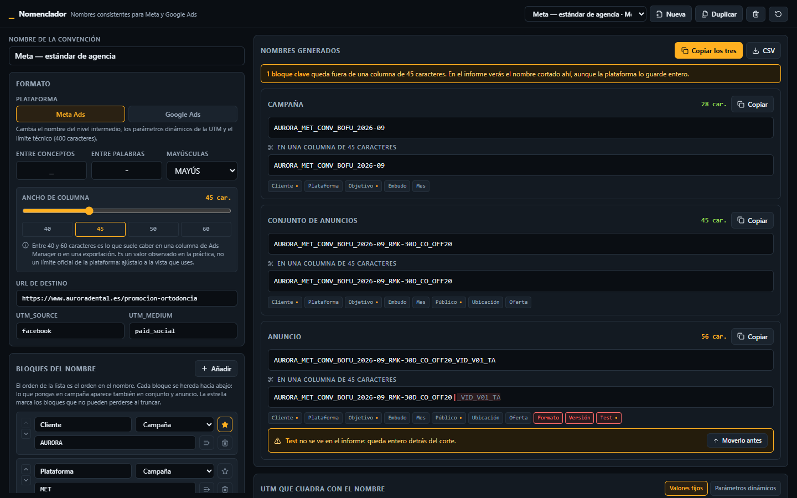
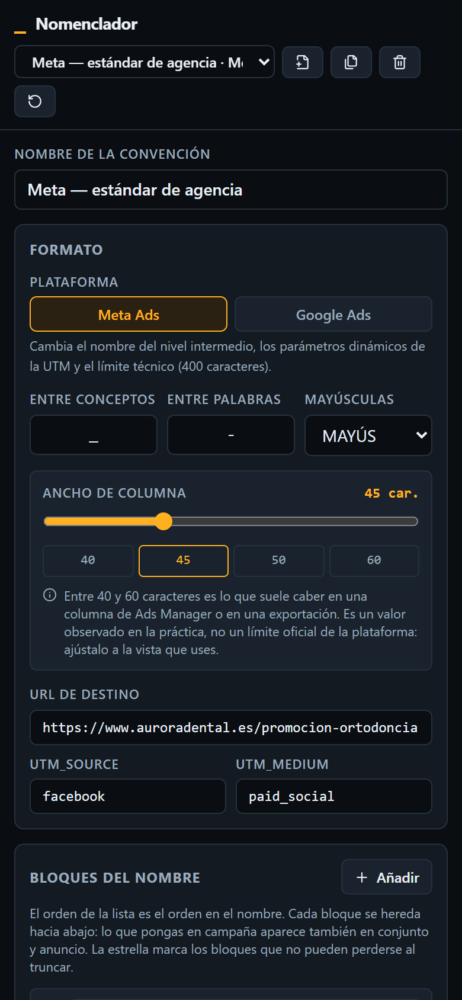
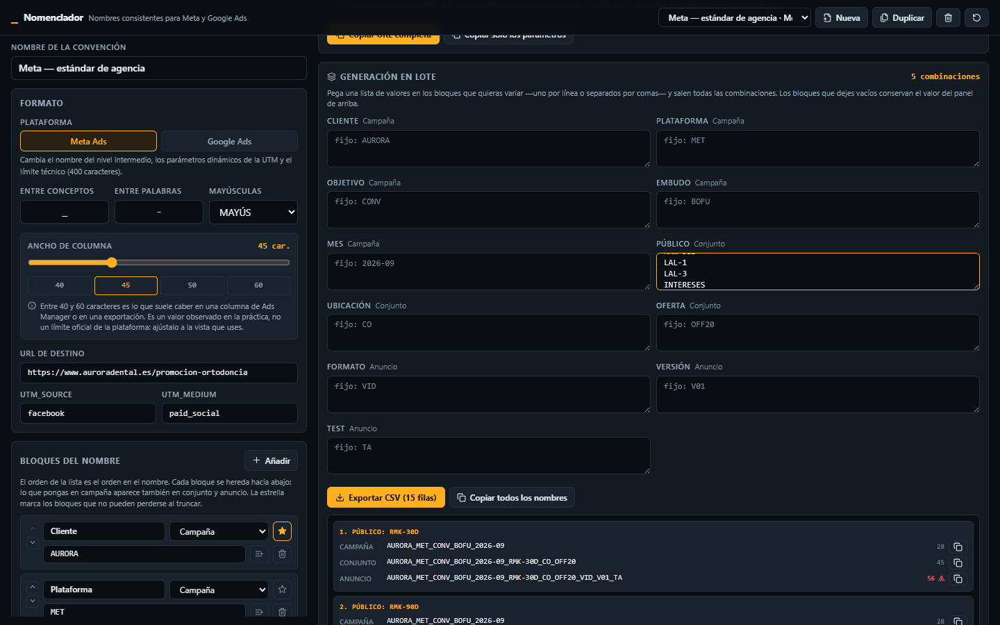

# Nomenclador

Dos herramientas para montar una campaña publicitaria antes de gastar un euro: un **generador de
nomenclatura** que devuelve los tres nombres —campaña, conjunto o grupo, y anuncio— ya formateados
para pegar en Ads Manager con la UTM que cuadra con ellos, y una **calculadora de presupuesto** que
dice cuánto hay que invertir para llegar a la meta y si los números dan.

**En vivo:** https://app09.reto.icebergmarketingdigital.com

Sin cuentas, sin instalar y sin conexión una vez cargada la página.

---

## Para quién

Para quien lleva varias cuentas publicitarias a la vez y, cada vez que lanza una campaña, escribe
los mismos tres o cuatro nombres a mano y estima el presupuesto en una hoja de cálculo distinta cada
mes. Con quince clientes —cada uno con su formato, su moneda y sus márgenes— la consistencia deja
de ser cuestión de memoria.

Las dos herramientas comparten el mismo selector de cliente: la convención de nombres y el escenario
de presupuesto se guardan juntos, porque describen al mismo cliente.

---

## Módulo 1 · Nomenclatura

Genera los tres nombres de la jerarquía a partir de una convención que defines tú.

| | |
|---|---|
| **Constructor de convención** | Bloques con nombre, nivel y orden. Separador entre conceptos y entre palabras, y capitalización. Varias convenciones guardadas, una por cliente si hace falta. |
| **Catálogo por bloque** | Cada bloque guarda sus valores con etiqueta legible y abreviatura (`Conversiones = CONV`). Aparecen como sugerencias al escribir, y siempre se puede escribir uno que no esté en la lista. |
| **Jerarquía que hereda** | Los bloques bajan por la jerarquía: lo que pones en campaña aparece también en conjunto y en anuncio. Cambiar un valor arriba actualiza los tres nombres al instante. |
| **Normalización** | Quita tildes y espacios, sustituye la ñ, colapsa separadores repetidos y aplica la capitalización. `Clínica Aurora Dental` sale como `CLINICA-AURORA-DENTAL`. |
| **Aviso de truncado** | Ver abajo. |
| **UTM que cuadra** | Valores fijos, o parámetros dinámicos por plataforma. |
| **Generación en lote** | Se pegan listas de valores en los bloques que se quieran variar y salen todas las combinaciones (producto cartesiano), hasta 300. |
| **Salida** | Copiar cada nombre por separado, los tres de una, o todos los del lote. Exportación a CSV con una fila por nivel. |

### El aviso de truncado

Meta admite nombres de unos 400 caracteres y Google Ads 128, pero las columnas de Ads Manager y las
exportaciones **truncan el texto visible mucho antes**, entre 40 y 60 caracteres según la vista. La
consecuencia práctica es la que importa: un nombre largo se corta justo donde está el identificador
del test, y ese dato no aparece nunca en el informe.

La app muestra en vivo:

- el **contador de caracteres** de cada nivel, en verde, ámbar o rojo;
- una **previsualización del nombre cortado** al ancho de columna, con el punto de corte marcado y
  la parte invisible atenuada;
- el **mapa de bloques**, señalando cuáles caen del lado que no se ve;
- un **aviso** cuando un bloque marcado como clave queda fuera, con un botón para moverlo antes en
  el orden;
- y aparte, en rojo, si el nombre supera el **límite técnico** de la plataforma.

El ancho de corte es configurable (20–100, con atajos a 40/45/50/60). Es un valor observado en la
práctica, **no un límite oficial de la plataforma**, y la interfaz lo dice.
Ver [DECISIONES.md § 2](DECISIONES.md).

### Las UTM

Con **valores fijos**, los nombres se escriben tal cual en la URL. Con **parámetros dinámicos**,
cada plataforma usa lo suyo:

- **Meta** rellena los parámetros al servir el anuncio: `{{campaign.name}}`, `{{adset.name}}`,
  `{{ad.name}}`, `{{placement}}` y `{{site_source_name}}`.
- **Google** no devuelve el nombre de la campaña por ValueTrack, solo su identificador. Por eso el
  nombre va escrito y se añaden `{keyword}`, `{matchtype}`, `{network}`, `{device}`, `{creative}`,
  `{campaignid}` y `{adgroupid}`. Ver [DECISIONES.md § 3](DECISIONES.md).

---

## Módulo 2 · Calculadora de presupuesto

Pestaña propia, mismo cliente.

**Entra:** meta mensual de ventas o leads, ticket promedio o valor del lead, margen bruto,
conversión del destino, CTR estimado, y CPC o CPM esperado con selector de cuál de los dos. Moneda
configurable (EUR, USD, COP).

**Sale:**

- **inversión mensual** necesaria y su equivalente diario;
- **ROAS de equilibrio** —el que iguala margen bruto e inversión— y el proyectado;
- **coste máximo por resultado** que puedes pagar sin perder dinero, y el proyectado;
- **volumen estimado**: impresiones, clics y conversiones;
- **cuenta de resultados** del escenario: ingresos, margen bruto y lo que queda tras la inversión.

**Cada resultado enseña su fórmula** con los números ya sustituidos, porque estos paneles se enseñan
a clientes y hay que poder defender cada cifra. Ver [DECISIONES.md § 4](DECISIONES.md).

### El semáforo

Mira dos cosas distintas y toma el peor de los dos resultados:

1. **Rentabilidad**, aritmética pura: el coste por resultado proyectado frente al máximo que deja
   cada resultado (`ticket × margen`). Si lo supera, la campaña pierde dinero por diseño.
2. **Realismo**, frente a un rango de coste por resultado. Si el techo que puedes pagar está por
   debajo del mínimo del rango, no compras ese resultado a ese precio ni con la campaña perfecta.

Cuando sale rojo, despeja las tres salidas: a cuánto habría que subir el ticket, el margen o la
conversión para llegar al equilibrio —y avisa cuando alguna de las tres es imposible.

> **Los rangos de referencia son tuyos, no de la plataforma.** Ni Meta ni Google publican coste por
> resultado por sector, así que no hay dato oficial que citar. La app trae cuatro rangos de partida,
> marcados como estimación propia y editables. Ver [DECISIONES.md § 5](DECISIONES.md).

### El CTR, una entrada que no estaba en el encargo

Sin CTR no se puede pasar de clics a impresiones ni calcular con CPM, y las dos cosas estaban
pedidas en la salida. Está como campo visible y editable, no escondido en una constante inventada.

### El puente entre los dos módulos

**«Pasar al nomenclador»** deja la inversión mensual como un bloque más del nombre
(`…_1200EUR`), lo anota en el panel de nombres con el coste máximo por resultado, y lo exporta en
las columnas `inversion_mensual` y `coste_por_resultado` del CSV.

---

## Los dos escenarios de la prueba real

Ejecutados contra la app publicada, con clientes ficticios. Los números completos, con sus fórmulas
y su diagnóstico, están en [DECISIONES.md](DECISIONES.md#los-dos-escenarios-de-la-prueba-real).

**Aurora Dental** — 40 leads/mes a 320 € de valor y 55 % de margen, con conversión del 3,2 % y CPC
de 0,96 €. Necesita **1.200 €/mes** (39,42 €/día) para 138.889 impresiones y 1.250 clics. Paga
**30 € por lead de los 176 € que puede permitirse**: 83 % de colchón. ROAS proyectado 10,67× contra
un equilibrio de 1,82×. **Verde.**

**Bruma Accesorios** — 150 ventas/mes de un ticket de 24 € al 25 % de margen, con conversión del
1,8 % y CPC de 0,72 €. Necesitaría **6.000 €/mes** para pagar **40 € por una venta que deja 6 €**.
ROAS proyectado 0,60× contra un equilibrio de 4,00×. **Rojo por los dos motivos**, y de las tres
salidas ninguna es realista: el ticket tendría que irse a 160 €, la conversión al 12 %, y por margen
no hay salida porque haría falta un 167 %.

---

## Stack

Vite · React 18 · TypeScript · Tailwind CSS · lucide-react.

Sin backend, sin base de datos, sin IA y sin una sola llamada de red: todo se guarda en el
`localStorage` del navegador. Tipografía del sistema, sin fuentes externas, para que funcione sin
conexión de verdad. No hay cuentas ni registro.

```bash
npm install
npm run dev      # http://localhost:5179
npm run build
./deploy.sh      # build en local + subida al servidor
```

### Cómo está organizado

```
src/
├── tipos.ts            Tipos compartidos por los dos módulos
├── nomenclatura.ts     Normalización, jerarquía y cálculo del corte
├── utm.ts              Parámetros por plataforma y composición de la URL
├── presupuesto.ts      Motor de cálculo: cada magnitud con su fórmula
├── lote.ts             Producto cartesiano y exportación a CSV
├── almacen.ts          localStorage, con migración de lo guardado
├── demo.ts             Tres convenciones de ejemplo con su escenario
└── componentes/        Paneles de la interfaz
```

La pieza que sostiene el aviso de truncado es `generarNombre()`: además del texto devuelve, por cada
bloque, el índice donde empieza y donde acaba dentro del nombre. Con esos offsets salen el aviso, el
mapa de colores y las columnas `visible_al_corte` y `oculto_al_corte` del CSV, sin recalcular nada.

---

## Capturas

| | |
|---|---|
|  |  |
|  | |

En `capturas/prueba-real/` hay nueve más, tomadas contra la app publicada: el constructor de
convención con su catálogo, los tres niveles, el aviso de truncado, las UTM de Meta y de Google, el
lote, la calculadora y el semáforo en rojo.
